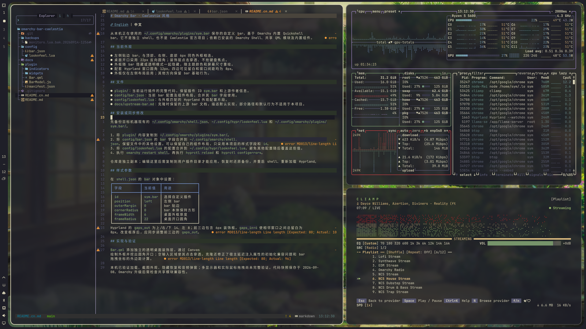

# Omarchy Bar · Caelestia 风格

[English](README.md) | **中文**

从本机正在使用的 `~/.config/omarchy/plugins/sym.bar` 保存的自定义 bar，基于 Omarchy 内置 Quickshell bar。它不是独立 shell，也不是 Caelestia 官方项目；依赖已安装的 Omarchy Shell、共享 QML 模块及内置组件。

## 当前外观

- 左侧贴边 bar，与顶部、右侧、底部 6px 同色外框相连。
- 桌面开口采用 22px 反向圆角；装饰层点击穿透、不抢键盘焦点。
- 外框随 bar 隐藏或透明模式一起隐藏，随主题颜色和屏幕尺寸重绘。
- 配套 Hyprland 窗口圆角 12px，四边可见留白和窗口间距均为 8px。
- 外框仅在左侧布局启用；其他方向保留 bar 基础行为。

## 文件

- `plugin/`：当前运行插件的完整代码，保留插件 ID `sym.bar` 和上游作者信息。
- `config/bar.json`：当前 bar 配置及组件布局，合并其 `bar` 字段使用。
- `config/looknfeel.lua`：与外框匹配的 Hyprland 外观配置片段。
- `docs/upstream-bar.md`：克隆时保留的上游 bar 文档，描述默认实现，部分路径和默认行为不适用于本项目。

## 安装或同步修改

先备份目标机器现有的 `~/.config/omarchy/shell.json`、`~/.config/hypr/looknfeel.lua` 和 `~/.config/omarchy/plugins/sym.bar/`。

1. 将 `plugin/` 内容复制到 `~/.config/omarchy/plugins/sym.bar/`。
2. 将 `config/bar.json` 的 `bar` 字段合并到 `~/.config/omarchy/shell.json`，保留文件中的其他设置。可以保留自己的组件布局，只采用本项目的样式字段和 `id`。
3. 将 `config/looknfeel.lua` 的配置合并到 `~/.config/hypr/looknfeel.lua`，避免其他配置随后覆盖这些值。
4. 执行 `omarchy restart shell`，再执行 `hyprctl reload` 和 `hyprctl configerrors`。

仓库是独立副本；编辑这里后需复制到用户插件目录才能应用。恢复时还原备份，并重启 shell、重新加载 Hyprland。

## 样式参数

在 `shell.json` 的 `bar` 对象中设置：

| 字段 | 当前值 | 用途 |
| --- | --- | --- |
| `id` | `sym.bar` | 选择自定义插件 |
| `position` | `left` | 左侧 bar |
| `outerMargin` | `0` | bar 贴边 |
| `cornerRadius` | `0` | bar 本体保持方形 |
| `frameWidth` | `6` | 桌面外框厚度 |
| `frameRadius` | `22` | 桌面开口圆角 |

Hyprland 的 `gaps_out` 为上/右/下 14、左 8；前三边包含 6px 装饰框。`gaps_in=4` 使相邻窗口之间总留白为 8px。改变框厚后，应同步调整前三边的 `gaps_out`。

## 实现与验证

`Bar.qml` 添加独立的透明桌面装饰层，通过 Canvas 绘制外框并挖出圆角开口；空输入区域使其点击穿透。克隆还修正了宿主延迟注入属性的初始化兼容问题和 bar 拖拽坐标的外边距计算。

本机已验证加载、截图外观、隐藏恢复和音频弹窗；多显示器和实际鼠标拖拽尚未完整验证。代码快照保存于 2026-09-08，Omarchy 升级后需检查共享模块兼容性。
